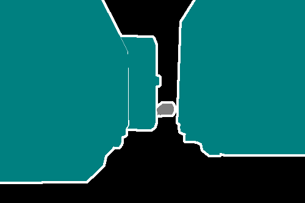
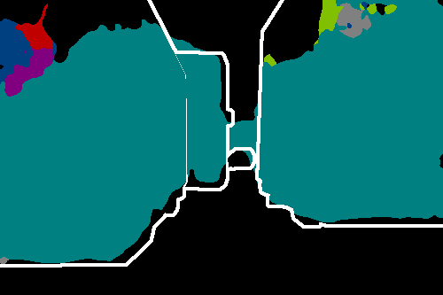
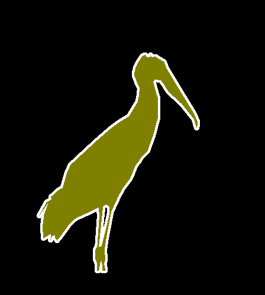
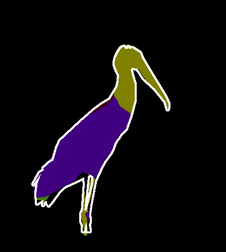
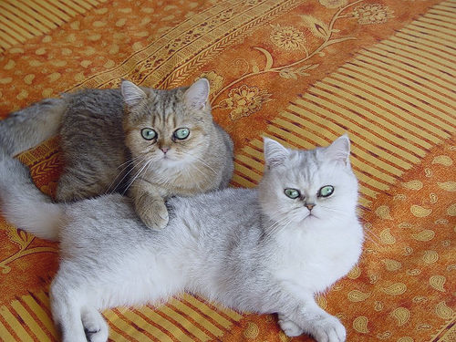
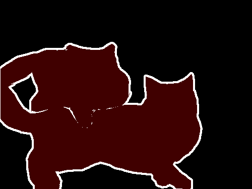
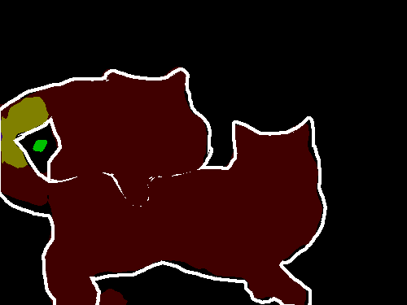

# UNet for Semantic Segmentation

This is a PyTorch implementation of  [UNet](https://arxiv.org/abs/1505.04597) by Olaf Ronneberger, Philipp Fischer, Thomas Brox.

## Examples
Original | Ground truth | prediction 
:---: | :---: | :---:|
 |  | 
 ||
||

## Training
To train the model(s) in the paper, run this command:

```train
python train.py --experiment <dilation/u_net/spp> --nepoch 100
```

## Evaluation
To evaluate my model on ImageNet, run:

```eval
python test.py --modelRoot dilation --epochId 100 <--isDilation/--isSpp>
```
>`--isDilation` use the dilation model, `--isSpp` use the spacial pyramid model. If no flag is given, use the default UNet model.


## Performance
PASCAL VOC 2012

Class | mIOU Unet | mIOU Unet+Dilation | mIOU Unet+SPP
:---: | :---: | :---:| :---:
class_0| 88.344| 88.798 | 87.693
class_1| 62.029| 68.246 | 69.541
class_2| 40.748| 46.652 | 39.747
class_3| 43.905| 42.988 | 40.677
class_4| 33.379| 39.225 | 34.799
class_5| 31.942| 33.789 | 31.858
class_6| 63.776| 62.690 | 69.799
class_7| 63.798| 55.148 | 55.688
class_8| 56.198| 54.462 | 42.995
class_9| 16.452| 16.671 | 13.750
class_10| 33.905| 32.777 | 48.872
class_11| 29.649| 29.333 | 36.456
class_12| 41.450| 43.557 | 26.315
class_13| 39.817| 35.576 | 32.586
class_14| 54.016| 57.910 | 57.604
class_15| 64.904| 67.516 | 67.026
class_16| 36.657| 32.642 | 35.091
class_17| 42.085| 49.564 | 40.449
class_18| 22.395| 22.079 | 20.693
class_19| 50.392| 51.356 | 45.502
class_20| 40.183| 42.299 | 38.571
**Mean**|**45.524**| **46.346**| **44.557**

## Reference
1. Ronneberger, Fischer, Brox. "U-Net: Convolutional Networks for Biomedical Image Segmentation" [arXiv:1505.04597](https://arxiv.org/abs/1505.04597)
2. [Spacial pyramid pooling](https://medium.com/analytics-vidhya/ml-in-detail-1-pspnet-4527036af33b)